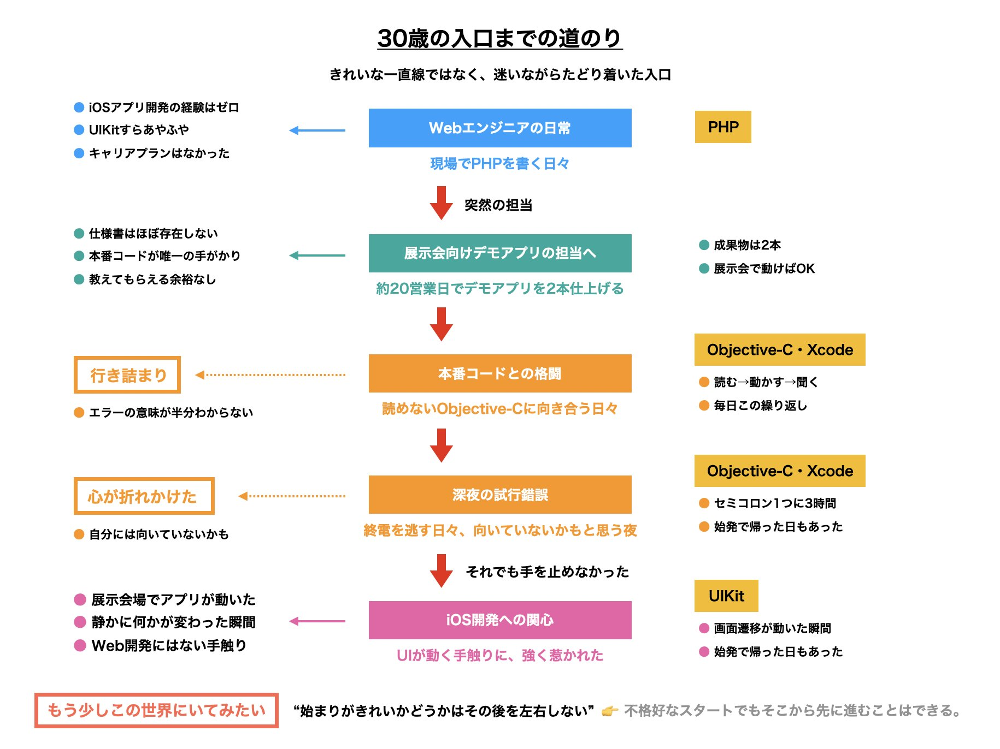
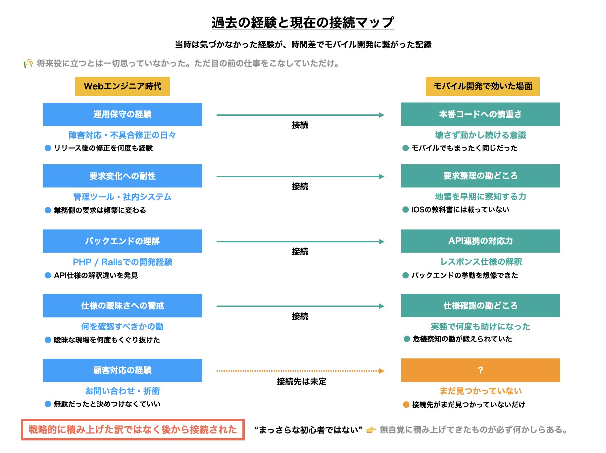
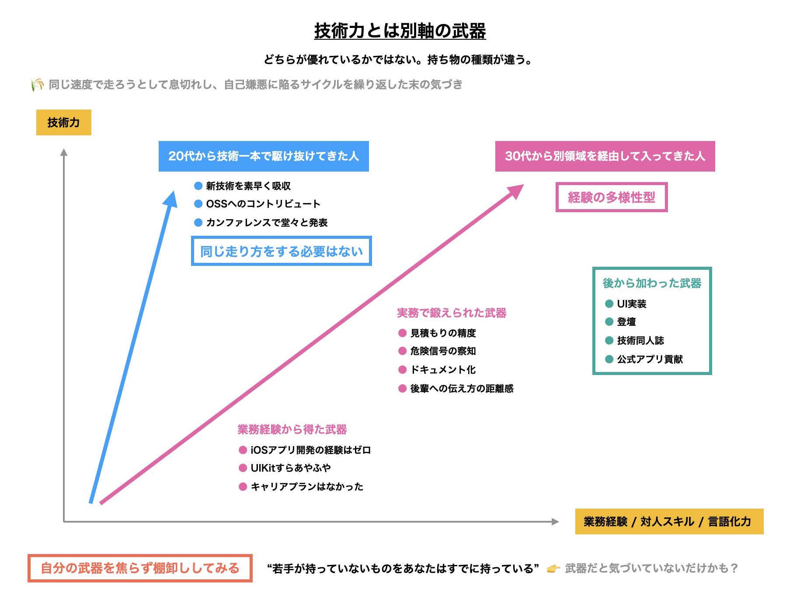
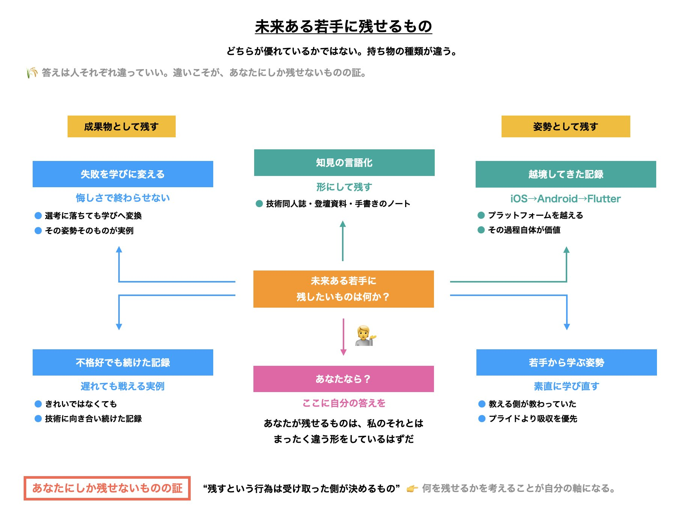

# 遠回りでも接続はできる：30歳からモバイル開発を始めた私が今考えていること

---

## はじめに

私がObjective-Cに初めて触れたのは30歳のときだった。

当時はWebエンジニアとして出向先の現場で働いていて、iOSアプリ開発の経験はほとんどなかった。UIKitという言葉を聞いたことはあったが、自分で書いたことは一度もない。そんな状態で、ある展示会向けのデモアプリ開発を任されることになった。

渡されたのは、本番アプリのソースコード一式。仕様書と呼べるものはほぼ存在しない。そこから必要な機能だけを切り出して、約20営業日でデモアプリを2本作る。それが与えられたミッションだった。

本番アプリのコードは、率直に言って読みやすいものではなかった。どこに何が書いてあるのかを把握するだけで最初の数日が消えていった。Objective-Cの文法もわからないまま、エラーメッセージを検索しては一つずつ潰していく。深夜のオフィスでXcodeの画面を睨みながら、自分は何をやっているんだろうと思った夜が何度もあった。

格好いい話ではない。計画的にキャリアチェンジしたわけでもないし、誰かにメンターとして導いてもらったわけでもない。ただ目の前に降ってきた仕事に必死で食らいついた結果、たまたまそこにモバイルアプリ開発の入口があった。それだけのことだ。

でも、あの数週間が私の原点になった。画面の中でボタンが一つ動いた瞬間、それまでの疲労がすっと引いていく感覚があった。指で触れた操作が目の前で反応として返ってくる。その手触りに、自分でも驚くほど強く惹かれていた。

この原稿では、30代から始めても成功できるという話を書きたいわけではない。私が書きたいのはもっと地味で不格好な話だ。遠回りした経験は、時間差があっても今の取り組みに接続できる。そしてその接続のしかたは人それぞれ違っていい。自分自身の遠回りを振り返りながら、そのことを言葉にしてみたいと思う。

---

## 1. 30歳、仕様のないコードから始まった

展示会向けのデモアプリ開発がどういう状況だったか、もう少し具体的に書いておきたい。

まずObjective-Cの経験はゼロだった。参照できる仕様書もない。唯一手がかりになるのは本番アプリのコードだが、長い年月をかけて色々な人が手を入れてきたそのコードは、初見の人間にとって親切な構造にはなっていなかった。期限は約20営業日。その中で展示用のデモアプリを2本仕上げなければならない。

振り返ると、かなり無茶な話だったと思う。ただ当時の自分にはそれが無茶だという判断基準すらなかった。わからないことがあればまずコードを読む。読んでもわからなければ動かして確かめる。それでもわからなければ詳しそうな人をつかまえて聞く。毎日その繰り返しだった。

途中で何度も心が折れかけた。ビルドが通らない原因を3時間探して、結局セミコロンが一つ抜けていただけだったときは、さすがに笑うしかなかった。自分にはこの領域は向いていないのかもしれないと思った夜もある。

それでも手を止めなかったのは、UIが動く瞬間の感触がどうしても忘れられなかったからだ。画面遷移が意図通りに動いたとき、アニメーションが滑らかに再生されたとき、言葉にしにくい小さな達成感がある。Web開発をしていたときには感じたことのない種類の手触りだった。

デモアプリがなんとか完成し、展示会場で実際に動いているのを見たとき、誰かに褒められたわけではないが自分の中で静かに何かが変わった。もう少しこの世界にいてみたい。その感覚だけを頼りに、私はモバイルアプリ開発の世界に居続けることを選んだ。

始まりがきれいかどうかは、その後を左右しない。不格好なスタートでも、そこから先に進むことはできる。少なくとも私の場合はそうだった。

---

## 2. 遅れではなく接続だった

モバイル開発を始めた当初、自分のことを完全な初心者だと思っていた。周りには学生時代からObjective-Cを書いていたエンジニアもいて、その差は歴然としていた。30歳から始めた自分は遅れているのだという意識が、常に頭のどこかにあった。

ところが実際に手を動かし続けていくうちに、不思議なことに気づく。Webエンジニアとして過ごしてきた数年間の経験が、思っていた以上にモバイル開発の現場で効いてくるのだ。

たとえば運用保守の経験。Webの現場で障害対応やリリース後の不具合修正を繰り返してきたことで、本番環境で動いているコードに手を入れるときの慎重さが身についていた。新しい機能を作ることだけがエンジニアの仕事ではなく、壊さずに動かし続けることの重みを体で知っていた。それはモバイルアプリの開発でもまったく同じだった。

管理ツールや社内向けシステムの開発で、業務側の要求がどれほど頻繁に変わるかを見てきた経験も大きかった。仕様が曖昧なまま走り出す現場で、何を確認しておくべきか、どこに地雷がありそうかという勘は、iOSの教科書には載っていないが実務では何度も助けになった。

Railsで開発していた時期に身についたバックエンドへの理解も、予想外のところで接続した。あるとき、iOSアプリの不具合報告が上がってきたことがある。クライアント側の実装だけでは原因が説明できず、API側のレスポンス仕様の解釈違いが絡んでいるらしいと気づけたのは、バックエンドの挙動をある程度イメージできたからだった。純粋にiOS開発だけをやってきた人なら、もう少し時間がかかっていたかもしれない。

ここで書きたいのは、過去の経験が無駄にならなかったから良かったという単純な話ではない。大事なのは、当時はそれが将来何かの役に立つとは一切思っていなかったという点だ。ただ目の前にある仕事をこなしていただけで、戦略的に何かを積み上げていたわけではない。それが何年も経ってから、自分でも予想しなかった場面で接続された。

30代から新しい領域に踏み出す人は、まっさらな初心者ではない。それまでの仕事の中で、自覚なく積み上げてきたものが必ず何かしらある。それがいつ、どこで効いてくるかは始めた時点ではわからない。わからないまま手を動かし続けるしかない。後になって振り返ったときに初めて、ああこれはここに繋がっていたのかと気づく。私にとっての接続とはそういうものだった。

もしこの文章を読んでいるあなたにも、今の挑戦とは無関係に見える過去の経験があるなら、それを無駄だったと決めつけなくていいと思う。接続先がまだ見つかっていないだけかもしれない。

---

## 3. 若手と同じ走り方をしなくていい

モバイル開発の世界には、20代のうちから第一線で活躍している人がたくさんいる。新しいフレームワークをあっという間に吸収し、カンファレンスで堂々と発表し、OSSにコントリビュートしている。そういう人たちの姿を見るたびに、自分との差を突きつけられるような気持ちになった時期がある。

帰り道に、もう追いつけないのかもしれないと思ったことは一度や二度ではない。同じ速度で走ろうとして、息切れして、自己嫌悪に陥る。そんなサイクルを何度か繰り返した末に、あるとき考え方を切り替えた。

そもそも同じ走り方をする必要がないのではないか。

これは努力をやめるという意味ではない。走り方を自分に合わせて変えるということだ。20代前半から技術一本で駆け抜けてきた人と、30代から別の領域を経由して入ってきた自分では、持っているものが違う。だったら、その違いを活かした走り方をすればいい。

30代から始めた人間には、技術力とは別の軸で武器になるものがある。たとえば業務経験の幅だ。エンジニア以外の職種と仕事をしてきた経験があると、デザイナーや企画職の言葉を自分なりに翻訳できるようになる。仕様の行間を読む力や、曖昧な依頼の裏にある本当の目的を汲み取る勘も、年数を重ねた人の方が鋭いことが多い。

運用フェーズを長く見てきた人間は、作って終わりではなく動かし続けることへの想像力を持っている。失敗を何度も経験してきた人は、何が危険信号なのかを早い段階で嗅ぎ分けられる。見積もりの精度、ドキュメント化の習慣、後輩に何かを伝えるときの距離感。どれも技術書を読んだだけでは身につかない類のものだ。

私自身の場合、そこにUI実装への強い興味が加わった。そして登壇の機会や技術同人誌の執筆、公式アプリへのコントリビューションが少しずつ積み重なっていった。どれも最初から計画していたわけではない。目の前にあった小さな機会に手を伸ばし続けた結果、気づけば自分なりの武器の形ができていたという感覚に近い。

大事なのは、自分がどんな武器を持っているかを焦らず棚卸ししてみることだと思う。そこにあるものは人によってまったく違う形をしている。若手が持っていないものを、あなたはすでに持っているかもしれない。ただ、それが武器だと気づいていないだけかもしれない。

---

## 4. 35歳以降は若手から学び下支えする

35歳を過ぎたあたりから、現場での自分の立ち位置が少しずつ変わってきたことを感じている。

チームを力強く牽引するリーダーになるという道もあるのだろうが、私の場合はそれとは少し違う方向にしっくりきた。若手の感覚から学びながら、チームの下支えに回る。地味だが、確かに必要とされる役割がそこにあった。

あるとき、チームに入ってきた若手のエンジニアが、私がずっと当たり前だと思い込んでいた実装パターンに対してまったく異なるアプローチを提案してきたことがある。最初は少し戸惑った。自分が何年もやってきたやり方を否定されたような気がして、正直あまりいい気分ではなかった。

でも話を聞いてみると、彼のアプローチには明確な根拠があった。私が長年アップデートしていなかった部分をピンポイントで突いていた。教える側のつもりでいたのに、教わっていた。そういう経験は、35歳を過ぎてから増えてきたように思う。

この年齢になって意識するようになったのは、若手が持っている新しい技術の感覚を変なプライドを持たずに吸収することだ。そしてそれを、自分がこれまで積み上げてきたものと接続できないか考えてみる。新しいものを学ぶ速度では若手にかなわなくても、学んだものを既存の文脈に紐づけて現場に落とし込むことは、経験がある人間の方が得意な場合がある。

もう一つ意識しているのは、現場でなんとなく詰まっている箇所を言葉にして共有することだ。暗黙知になっている判断基準を明文化すること。レビューの観点を属人的にしすぎず整理すること。QAやデザイナーとの間に立って橋渡しをすること。そうした知見を外に向けても発信すること。

どれも華やかな仕事ではない。評価に直結することも少ないし、感謝される機会も多くはない。でも、この地味な役回りこそが35歳以降の現場での在り方の一つだと思うようになった。チームの中で一番手にならなくても、確かに必要とされる場所はある。若手が安心して走れるように、コースの端で水を渡す係。今の自分はそういう立ち位置にいるのだと思う。

そしてそれは決して消極的な選択ではない。若手から新しいことを学び、自分の持ち物を更新し、現場の地盤を整え続ける。その循環の中にいることが、自分を古くしない方法でもあると感じている。

---

## 5. 技術コミュニティは自分を古くしない場所

社外の技術コミュニティに顔を出すようになったのは、モバイル開発を始めてしばらく経ってからのことだった。

最初の動機は正直に言うと承認欲求だったと思う。自分の存在を知ってもらいたい、同じ領域のエンジニアと繋がりたい。勉強会に参加して名刺を交換し、懇親会で少しでも爪痕を残そうとしていた。今思うと微笑ましいが、当時は必死だった。

初めて登壇したときのことは今でもよく覚えている。手が震えた。用意した内容の半分も話せなかった。終わった直後は、もう二度とやりたくないと本気で思った。ところが発表後に一人の参加者が声をかけてくれて、自分も似たような時期があったと言ってくれた。その一言で随分救われた記憶がある。技術コミュニティは上手にできる人だけの場所ではないのだと、あの瞬間に実感した。

続けていくうちに、コミュニティに対する向き合い方が少しずつ変わっていった。承認欲求を満たす場所から、自分の現在地を確認し持ち物を更新する場所へ。他社の事例を聞いて自分の現場との違いを知る。自分の知見を外の目にさらして、足りない部分を自覚する。圧倒的に強いエンジニアの発表を聞いて、追いかけるべき方向を見つける。公式アプリの開発に小さくでもコントリビュートして、第一線のコードに触れる機会を作る。技術同人誌という形で、自分の経験を一度まとまった文章にしてみる。

特に技術同人誌の執筆は、自分にとって大きな転機になった。日常の業務で得た知見は、言語化しなければ自分の中で曖昧なまま溶けていってしまう。一度文章にすることで、自分が何をわかっていて何をわかっていないのかが明確になる。書いたものが誰かの役に立つかどうかは正直わからないが、書くという行為そのものが自分の理解を深めてくれる。

技術コミュニティは若手だけの場所ではない。むしろ30代や40代になってからの方が、そこで得られるものの質が変わってくるというのが実感だ。20代の頃は新しい知識を吸収することが中心だったが、年齢を重ねると、自分が持っているものを外に出して検証する場所としての意味が大きくなる。凝り固まっていないかを定期的に確かめる、いわば定点観測の場所。私にとって技術コミュニティはそういう存在になっている。

---

## 6. 未来ある若手に何を残したいか

ここまで自分の遠回りしてきた道のりを書いてきた。ただ、この原稿で一番書きたかったことは、自分の過去の話ではなく、これから先に向けた一つの問いだ。

あなたが未来ある若手に残したいものは何か。

この問いに、私はまだはっきりとした答えを持っていない。持っていないが、考え続けることに意味があると思っている。

今の時点で、自分が残せるかもしれないと思っているものをいくつか挙げてみる。

UI実装を通じて積み重ねてきた知見がある。iOSからAndroid、そしてFlutterへと越境してきた記録がある。技術同人誌や登壇資料という形で言語化してきたものがある。手を動かしながら書き溜めてきた手書きのノートがある。技術的な課題に時間をかけて向き合い、解決まで昇華させたサンプルがある。

もっと泥臭いものもある。選考に落ちた経験を、悔しさのまま終わらせず学びに変えようとしてきた姿勢。若手から素直に学び直す姿勢。遅れて始めてもちゃんと戦えるという、自分自身の不格好な実例。きれいとは言えなくても、技術に向き合い続けてきた記録。

これらが本当に誰かの役に立つのかはわからない。そもそも残すという行為は、自分が決めるものではなく受け取った側が決めるものだと思う。それでも、何を残せるかを考えながら日々の仕事に向き合うことは、自分の取り組みに一本の軸を通してくれるような気がしている。

この問いは、30代から何かを始めた人にも、これから始めようとしている人にも、それぞれの答えがあっていいものだと思う。あなたが残せるものは、私のそれとはまったく違う形をしているはずだ。むしろ違っていて当然で、その違いこそがあなたにしか残せないものの証だ。

---

## おわりに

30代から何かを始めるとき、あの日始めていればという気持ちは必ず出てくる。私にも何度もあった。転職活動で若い候補者のポートフォリオを目にして黙り込んだ夜もあるし、技術記事を読んでいて知らない単語ばかりで静かに焦った休日もある。そういう瞬間は、40代になった今もゼロにはなっていない。

でも、いつも思い出す言葉がある。

今日という日は、自分に残された人生の中で一番若い日だ。

この言葉に出会ったのは、ある格闘家の入場曲がきっかけだった。試合前の緊張感の中で流れるその曲の歌詞に、こんなフレーズがあった。あの日始めれば良かった、その次に始めるべき時は今なのだと。その思いから逃れられないなら、自ら向かうしかないのだと。

私はこの言葉を聞いたとき、自分のここまでの遠回りを全部肯定してもらえたような気がした。大げさに聞こえるかもしれないが、30代から始めた人間にとって、この手の言葉は思った以上に深く刺さる。

きれいな道ではなかった。今も、きれいな道を歩けているとは言えない。それでも遠回りした分だけ、自分にしか持てない接続のしかたがある。その接続を一つずつ見つけながら、未来ある若手に何を残せるかを考え続けていくこと。それが、これからの自分のテーマだと思っている。

もしあなたが今、何かを始めるかどうか迷っているなら。もう遅いかもしれないと感じているなら。大丈夫だ。あなたのこれまでの遠回りも、きっとどこかで、これからの何かに接続する。

今日が一番若い日なのだから、まだ始められる。
